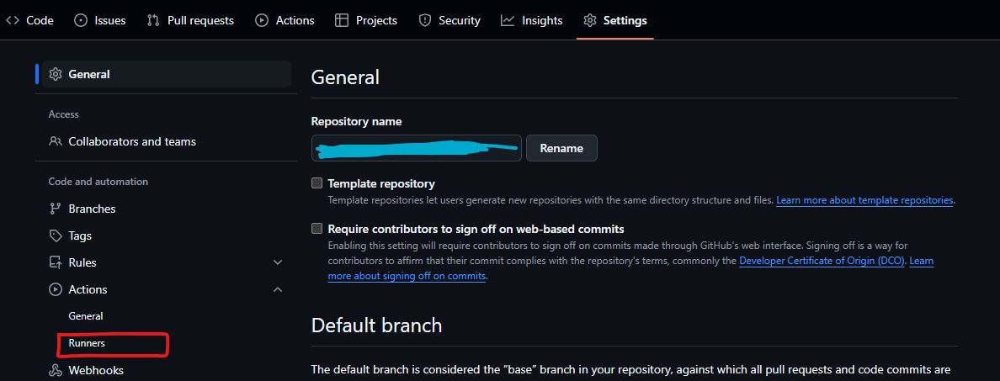
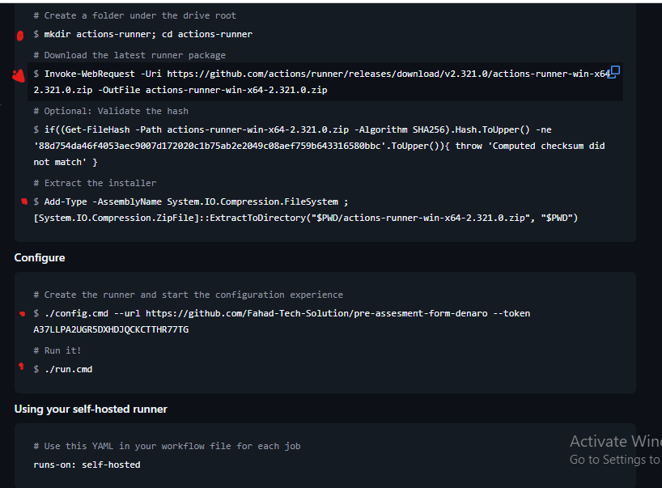
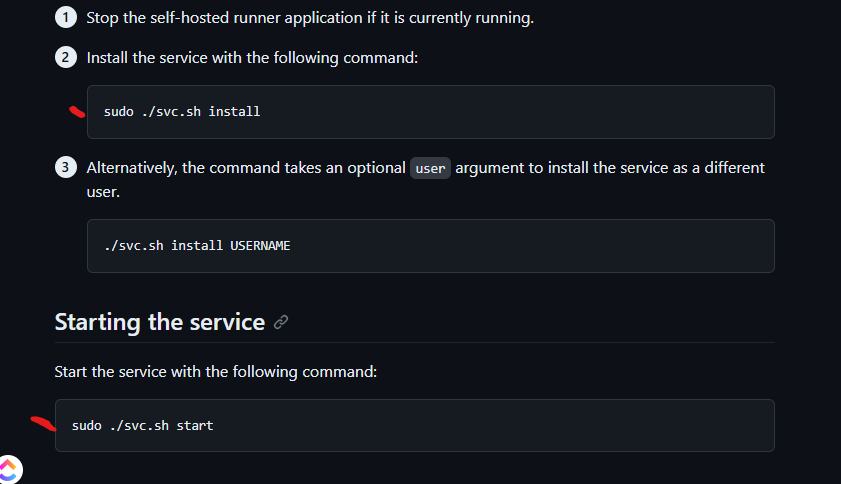

# Deployment through Pipeline

## How to Deploy Project through Pipeline from git hub 

- *Step1:* Create Instance on AWS/Azure which ever you want to create pipeline for

- *Step2:* install all required stuff like docker, unzip, github and Pm2 
  if you are doing it with docker its proper commands are following 
  sudo apt-get update && sudo apt-get install docker.io -y && sudo systemctl start docker 
  it some times need sudo systemctl daemon-reload

- *Step3:* go to GitHub repository and create Action from settings
  - *subTask1:* click on runner and create New self-hosted runner 
    

  - *subTask2:* Now chose os you created instance on although this will be enough for one time deployment but we need to handle it for auto     deployment every time we push on repository so click on `product docs` link which is just below all these instructions
  

    - *subTask2.2:* 
    

after all above steps you can see that your runner is created and its in idle state Now comes the Real Part
you need to create a .github folder and then create a workflows folder in in your project now create a cicd.yml file this file is very important for your task automation.

Following code is Sample code for this cicd.yml file 

`
name: Deploy Next.js application

on:
  push:
    branches:
      - master

jobs:
  build:
    runs-on: ubuntu-latest
    steps:
      # Prune Docker to free up space
      - name: Prune Docker System
        run: docker system prune -af --volumes

      # Checkout the source code
      - name: Checkout Source
        uses: actions/checkout@v4

      # Debug: Check the environment variables
      - name: Debug Info
        run: env

      # Create .env file from GitHub Secrets
      - name: Create .env file
        run: echo "SITE_URL=${{ secrets.SITE_URL }}" >> .env

      # Debug: Verify that the .env file was created successfully
      - name: Check .env file
        run: cat .env

      # Verify Docker installation and version
      - name: Check Docker Version
        run: docker --version

      # Build the Docker image
      - name: Build docker image
        run: docker build -t usamafaheemahmed/preassessmentform:latest .

      # Log in to Docker Hub
      - name: Login to docker hub
        run: docker login -u ${{ secrets.DOCKER_USERNAME }} -p ${{ secrets.DOCKER_PASSWORD }}

      # Debug: Verify Docker login status
      - name: Check Docker Login
        run: docker info

      # Push the Docker image to Docker Hub
      - name: Publish image to docker hub
        run: docker push usamafaheemahmed/preassessmentform:latest
              
  deploy:
    needs: build
    runs-on: self-hosted
    steps:
      # Cleanup Docker before pulling the new image
      - name: Stop all running containers
        run: docker stop --force $(docker ps -q) || true

      - name: Remove all containers
        run: docker rm --force $(docker ps -a -q) || true

      - name: Remove all Docker images
        run: docker rmi $(docker images -q) || true

      - name: Remove all Docker volumes
        run: docker volume rm $(docker volume ls -q) || true

      - name: Remove all Docker networks
        run: docker network prune -f || true

      - name: Clear Docker build cache
        run: docker builder prune -a -f || true

      # Pull the Docker image from Docker Hub
      - name: Pull image from docker hub
        run: sudo docker pull usamafaheemahmed/preassessmentform:latest

      # Delete the old container if it exists
      - name: Delete old container
        run: sudo docker rm -f nextjs-app-container || true # The || true ensures the step doesn't fail if no container exists

      # Run the Docker container
      - name: Run docker container
        run: sudo docker run -d -p 3000:3000 --name nextjs-app-container usamafaheemahmed/preassessmentform:latest

      # Debug: Check if the container is running
      - name: Check Docker Containers
        run: sudo docker ps -a

      # Debug: Verify that Dockerfile and context are correct
      - name: Verify Dockerfile and Context
        run: ls -l .
`

`${{ secrets.SITE_URL }}` , `${{ secrets.DOCKER_USERNAME }}`, and `${{ secrets.DOCKER_PASSWORD }}` these variable are not coming from github's secrets and variables option on setting

once you have done that you need to push code on github and it will perform all those tasks which are mentioned in cicd.yml file 

Major issues you can phase in this process 
1. linking of these variables through github: solution Make sure you have entered correct credentials
2. Permission issues in instance for Docker for that you can use `sudo chmod -R 777 <filename> ` this command and provide full privileges 
3. Memory full issues due to many images are present in instance's Docker system
    - To handle that you need to check if there are any images or containers present in docker if yes remove them 
        to check image run `sudo docker images`
        to remove all images run `sudo docker rmi $(sudo docker images -q)`
        to remove all images run `sudo docker rm 'ID'`

        to check container run `sudo docker container ls`
        to remove all containers run `sudo docker rm $(sudo docker ps -a -q)`
        to remove all containers run `sudo docker rm $'ID'`

        to check docker full memory consumption `sudo docker system df`
        to clean docker system run `sudo docker system prune -a --volumes`

        to check instance Memory `df -h`
        to clean instance fully run `sudo apt-get clean && sudo docker system prune -a --volumes`

      ###Faster way to do all that (stop and Delete Container and image then restart docker)
      to Delete container `sudo docker rm <Container_ID>`
      to Delete Image `sudo docker rmi <image_ID>` 
      to Restart `sudo systemctl restart docker`

## Note you need to remember
you need full relaxed mind to perform all of this it some times create some issues but don't worry every problem have a solution just don't panic
        
